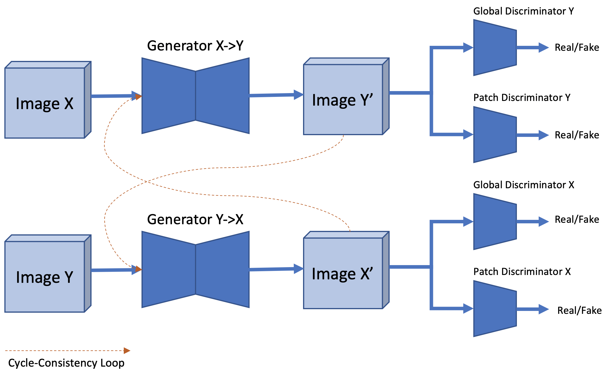
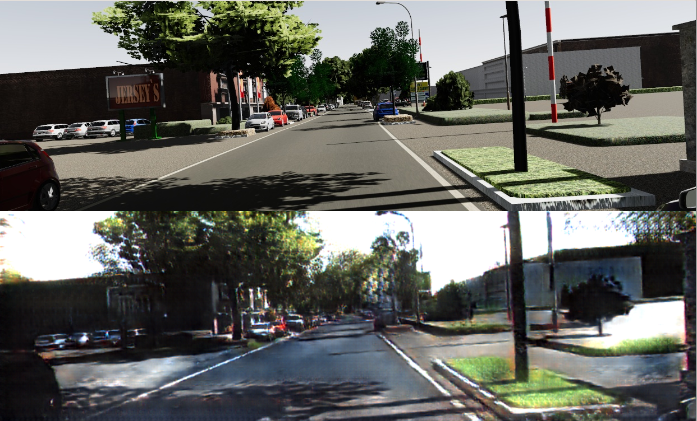
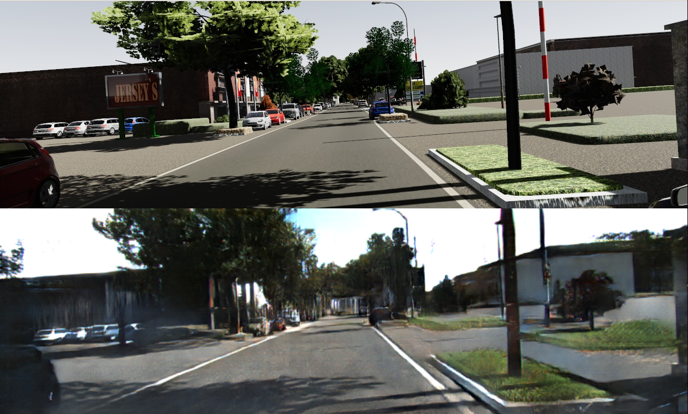
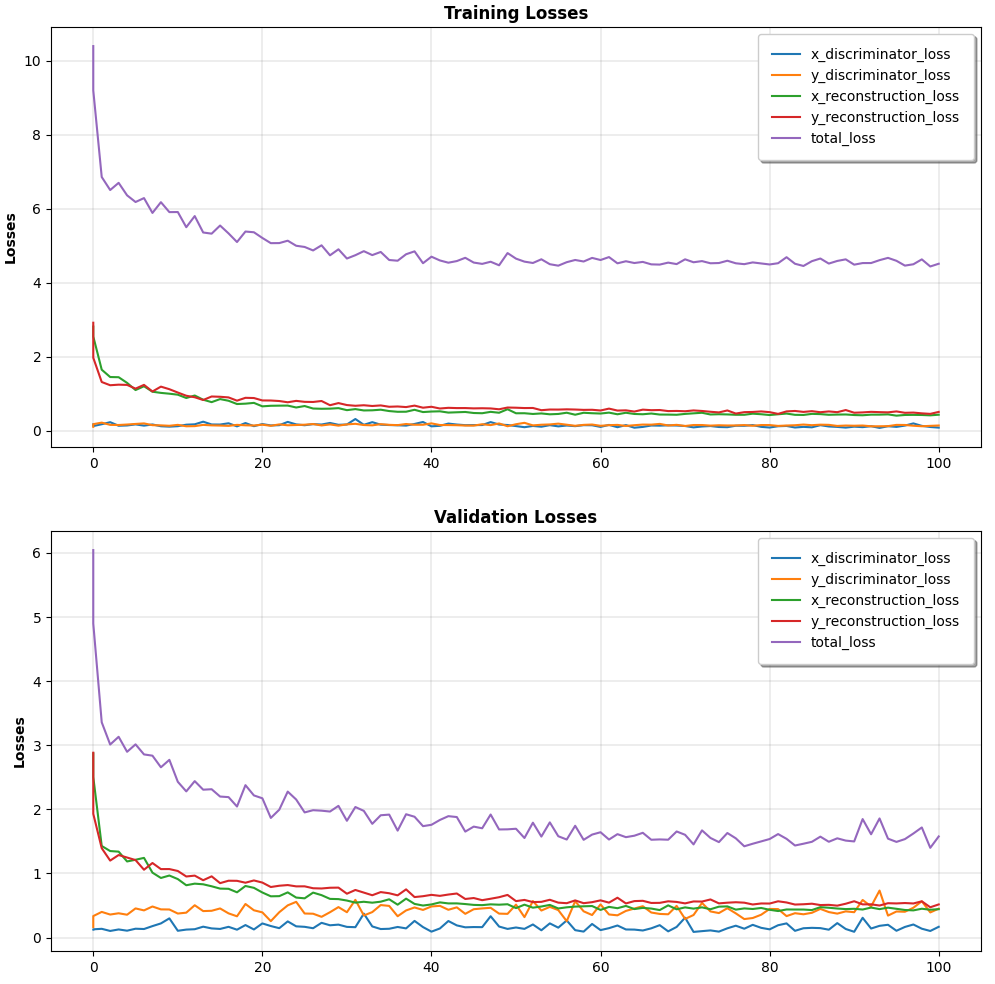

# [CycleGAN](https://junyanz.github.io/CycleGAN/), and its incremental improvement

This is a simple PyTorch implementation of [CycleGAN](https://junyanz.github.io/CycleGAN/) and a study of its incremental improvements.

   
*Figure 1: Training progress of CycleGAN with Global and Patch Discriminator on image resolution 1024x256*

CycleGAN provided a huge insight into the idea of cycle-consistency for domain adaptation. It initially proposed using a cycle-consistency loss combined with the adversarial loss to ensure that domain-translated image looks realistic while maintaining forward and backward consistency of the image. This was a great help towards solving the mode collapse problem and it also maintains the shape of objects within scene. The discriminator was proposed to output a single fake/real prediction, which since then have been proposed to be replaced with a patch discriminator. Patch discriminator looks at a small patch of the generator, say 16x16 patch, and classifies it as real/fake. This forces the generator to get the domain translation right down to smaller scale.

This works great for an image of say size 256x256, as shown in Figure 2, but have several failure cases when extended to a higher resolution image with different aspect ratio e.g. 1024x256. To counter that, I use two discriminators - (1) Global Discriminator with a single output, and (2) Patch Discriminator of size 64x16 for classifying patches of 16x16 as real/fake. This architecture is shown in Figure 3.

   
*Figure 2: Training progress of CycleGAN with a patch discriminator on image resolution 256x256*

   
*Figure 3: CycleGAN with Global and Patch Discriminator*

Qualitative comparision of CycleGAN result on an image resolution of 1024x256 for the architecture with only Patch Discriminator and the one with a combination of Patch Discriminator and Global Discriminator is shown below.  

| CycleGAN with only Patch Discriminator |  CycleGAN with Patch Discriminator and Global Discriminator |
|:--------------------------------------:|:-----------------------------------------------------------:|
| Virtual KITTI (Simulation Data)        | Virtual KITTI (Simulation Data)                             |
|  |                |
| Virtual KITTI to KITTI (Sim2Real)      | Virtual KITTI to KITTI (Sim2Real)                           |   

*Figure 4: Qualitative Comparision*

## Key Details

 - A combination of Patch Discriminator and Global Discriminator is used.  
 - Different Learning Rate is used for Generator and Discriminator. Discriminator uses a lower learning rate.    
 - Discriminator's learning is disabled during the training of Generator.   
 - Leaky Relu with a negative slope of 0.2 is used in Generator, but ReLU is used in Discriminator.  
 - Instance Normalization is used.  
 - Output of the Generator is clamped to output a value between [-0.5, 0.5].  
 - Results and model architecture are shown for image resolution of 1024x256.  

## Training and Validation Losses

   
*Figure 5: Training and Validation Losses*

## Model Architectures

### Generator
```
----------------------------------------------------------------
        Layer (type)               Output Shape         Param #
================================================================
            Conv2d-1         [-1, 64, 128, 512]           3,072
    InstanceNorm2d-2         [-1, 64, 128, 512]               0
         LeakyReLU-3         [-1, 64, 128, 512]               0
            Conv2d-4         [-1, 128, 64, 256]         131,072
    InstanceNorm2d-5         [-1, 128, 64, 256]               0
         LeakyReLU-6         [-1, 128, 64, 256]               0
            Conv2d-7         [-1, 256, 32, 128]         524,288
    InstanceNorm2d-8         [-1, 256, 32, 128]               0
         LeakyReLU-9         [-1, 256, 32, 128]               0
           Conv2d-10          [-1, 256, 16, 64]       1,048,576
   InstanceNorm2d-11          [-1, 256, 16, 64]               0
        LeakyReLU-12          [-1, 256, 16, 64]               0
           Conv2d-13          [-1, 256, 16, 64]         589,824
   InstanceNorm2d-14          [-1, 256, 16, 64]               0
        LeakyReLU-15          [-1, 256, 16, 64]               0
           Conv2d-16          [-1, 256, 16, 64]         589,824
   InstanceNorm2d-17          [-1, 256, 16, 64]               0
    ResidualBlock-18          [-1, 256, 16, 64]               0
           Conv2d-19          [-1, 256, 16, 64]         589,824
   InstanceNorm2d-20          [-1, 256, 16, 64]               0
        LeakyReLU-21          [-1, 256, 16, 64]               0
           Conv2d-22          [-1, 256, 16, 64]         589,824
   InstanceNorm2d-23          [-1, 256, 16, 64]               0
    ResidualBlock-24          [-1, 256, 16, 64]               0
  ConvTranspose2d-25         [-1, 256, 32, 128]       1,048,576
   InstanceNorm2d-26         [-1, 256, 32, 128]               0
        LeakyReLU-27         [-1, 256, 32, 128]               0
  ConvTranspose2d-28         [-1, 128, 64, 256]         524,288
   InstanceNorm2d-29         [-1, 128, 64, 256]               0
        LeakyReLU-30         [-1, 128, 64, 256]               0
  ConvTranspose2d-31         [-1, 64, 128, 512]         131,072
   InstanceNorm2d-32         [-1, 64, 128, 512]               0
        LeakyReLU-33         [-1, 64, 128, 512]               0
  ConvTranspose2d-34         [-1, 3, 256, 1024]           3,072
================================================================
Total params: 5,773,312
Trainable params: 5,773,312
Non-trainable params: 0
----------------------------------------------------------------
```

### Patch Discriminator

```
----------------------------------------------------------------
        Layer (type)               Output Shape         Param #
================================================================
            Conv2d-1         [-1, 64, 128, 512]           3,072
            Conv2d-2         [-1, 128, 64, 256]         131,072
    InstanceNorm2d-3         [-1, 128, 64, 256]               0
            Conv2d-4         [-1, 256, 32, 128]         524,288
    InstanceNorm2d-5         [-1, 256, 32, 128]               0
            Conv2d-6          [-1, 512, 16, 64]       2,097,152
    InstanceNorm2d-7          [-1, 512, 16, 64]               0
            Conv2d-8            [-1, 1, 16, 64]           4,608
================================================================
Total params: 2,760,192
Trainable params: 2,760,192
Non-trainable params: 0
----------------------------------------------------------------
```

### Global Discriminator

```
----------------------------------------------------------------
        Layer (type)               Output Shape         Param #
================================================================
            Conv2d-1         [-1, 64, 128, 512]           3,072
            Conv2d-2         [-1, 128, 64, 256]         131,072
    InstanceNorm2d-3         [-1, 128, 64, 256]               0
            Conv2d-4         [-1, 256, 32, 128]         524,288
    InstanceNorm2d-5         [-1, 256, 32, 128]               0
            Conv2d-6          [-1, 256, 16, 64]       1,048,576
    InstanceNorm2d-7          [-1, 256, 16, 64]               0
            Conv2d-8           [-1, 256, 8, 32]       1,048,576
    InstanceNorm2d-9           [-1, 256, 8, 32]               0
           Conv2d-10           [-1, 256, 4, 16]       1,048,576
   InstanceNorm2d-11           [-1, 256, 4, 16]               0
           Conv2d-12            [-1, 256, 2, 8]       1,048,576
   InstanceNorm2d-13            [-1, 256, 2, 8]               0
           Conv2d-14            [-1, 256, 1, 4]       1,048,576
   InstanceNorm2d-15            [-1, 256, 1, 4]               0
          Flatten-16                 [-1, 1024]               0
           Linear-17                   [-1, 64]          65,600
           Linear-18                    [-1, 1]              65
================================================================
Total params: 5,966,977
Trainable params: 5,966,977
Non-trainable params: 0
----------------------------------------------------------------
```